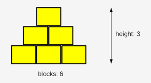

# Problem Class 1

Below are a number of challenges for you to complete

They vary in difficulty - if you get stuck always feel free to try another and come back to it - you may learn something to help you

Only submit once you have completed all work - run your own tests in the meantime to check your work

**Remember when you submit to always remove all print statements you have written at the bottom of the code - these break the auto tests**

## Task 1 - Sum of Resistors in a Circuit

Resistors are a simple electronic component which lowers the available voltage in a circuit

The total resistance of a simple circuit can be found by simply summing the resistance of all resistors in it (adding them up), resistance is measured in Ohms

You are to write a program which will ask the user to input various information

First, the user should be asked to enter a number of resistors in a circuit

Then, the user should be asked to input a value in Ohms for each resistor

The code should then calculate the total resistance of the circuit using this information and store this value in a variable called total_resistance

## Task 2 - Cost of Meal

You have a function which will be passed a numeric value above zero stored in the variable "cost"

You need to write a program which will calculate the VAT (20%)

The program should also ask the user to input a value for the tip (as a percentage) - this cannot be less than zero so check it! The user should be re-prompted to enter a value if they enter a value below zero

You shoud use this percentage value to calucuate the percentage of the bill to add on as a tip, before the tax is added

Add all this together and store in a variable called total_cost

**ADDED CHALLENGE** - the user should be able to type in a decimal amount for the tip

## Task 3 - Fizz Buzz

Write asks the user to input an integer above zero - your progam should ensure that the number is above zero and prompt the user to try again if it is not

The program will then loop through the numbers 1 to the number the user entered, appending each number to a list called _result_...unless:

* If the number is a multiple of three, the program should instead append the word "Fizz" to the list _instead_ of the number
* If the number is a multiple of five, the program should instead append the word "Buzz" to the list _instead_ of the number
* If the number is a multiple of three _and_ five, the program should instead append the words "Fizz Buzz" to the list _instead_ of the number

## Task 4 - Collatz Conjecture

In 1937, a German mathematician called Lothar Collatz created a hypothesis 

It is described in the following way:
* Take any _non-negative_ and _non-zero_ integer, which we will call "n"
* If n is even, evaluate a new "n" as n / 2
* Otherwise, if n is odd, evaluate a new "n" as 3n + 1
* This process then repeats

The hypothesis states that regardless of what number you start with, the sequence of numbers will always go to 1

Note - once a number hits 1 it enters a closed loop:
* 3 x **1** + 1 = 4
* **4** / 2 = 2
* **2** / 2 = 1
* Closed loop restarts

Write a short program which implements this, the program should ask the user for a positive integer number (and verify this) then run through the process untill it reaches the number 1

Each number that "n" takes the value of should be added to the result list, starting with the value the user enters

## Task 5 - Building Blocks

A boy and his father are playing with wooden blocks to build a 2D pyramid - i.e. a pyramid shaped wall



Your task is to write a program which asks the user to input a non-negative and non-zero integer value

This integter will be the number of blocks that are available to build with

You must then write some code which calculates the max height the "pyramid" can be using the number of blocks

Note - the height is measured by the total number of _complete_ layers, if there are insufficient blocks for the next layer then work should immediately stop!

The maximum height should be stored in the variable "height"

For example:

```
Sample input: 6 --> Expected output: 3
Sample input: 20 --> Expected output: 5
Sample input: 1000 --> Expected output: 44
```